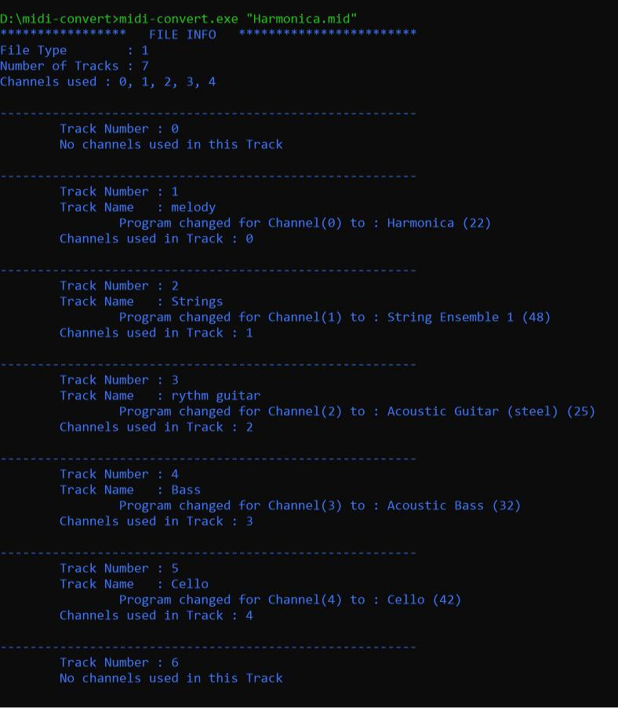
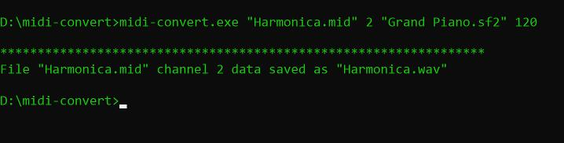

# midi2wav | Midi-Convert Utility.

This is a small utility which can be used to see the channels / tracks detail in a MIDI file and can be used to extract a single channel music from the MIDI file and save it as a wav file.

Note : We have used an external library “fluidsynth” library for converting the MIDI file to wav file. This requires us to ship some additional dlls as given in the “Additional Dll to Ship” folder. Content of this folder must be copies in the same folder in which the executable resides for the proper functioning of the utility.

This utility can be used in 2 ways:

## Display MIDI file data 

Usage:midi-convert.exe [input-midi-file-name.mid]

The required arguments:

[input-midi-file-name.mid]	... an input Midi source file

##  Extract Channel data from MIDI file 

Usage:midi-convert.exe [input-midi-file-name.mid] [channel-number] [our-sound-font-file.sf2] [bpm]

The required arguments:

[input-midi-file-name.mid]	... an input Midi source file

[channel-number]	... channel whose data is to be retained.

[our-sound-font-file.sf2]	... an input SoundFont file to use

The optional arguments:

[BPM]	... desired BPM for the file.

